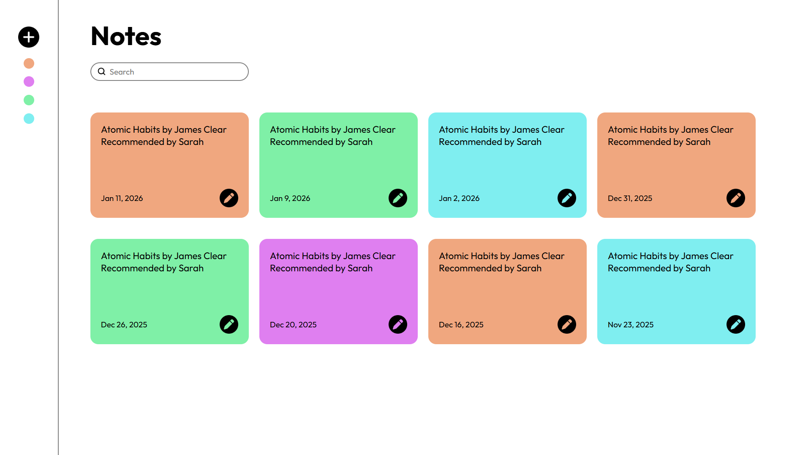

# Notes App Frontend 📝

 

A clean, colorful, and responsive sticky notes interface built using pure HTML and CSS. This project focuses on grid layouts, color theory, and efficient use of Flexbox.

## 📸 Output

## 🛠️ Tech Stack

* **HTML5**: For structure and semantic markup.
* **CSS3**: For styling, including:
    * **Flexbox**: For creating the responsive grid layout of the notes.
    * **CSS Variables**: For managing the different sticky note colors.
    * **Box Model**: For spacing, padding, and rounded corners.

## 📚 About the Project

This project was created as part of my learning journey in frontend development. The goal was to build a visually appealing "Notes" dashboard that mimics real-world sticky notes.

**Key Learnings:**
* How to use `display: flex` and `flex-wrap` to create a grid system.
* Managing consistent spacing between multiple cards.
* Styling form elements like the search bar and buttons.

## 🙌 Credits & Acknowledgements

This project was built while learning from the **"Complete Web Development Course"** on Udemy.

A huge thanks to my instructor, **Hitesh Choudhary**, for being an awesome teacher and explaining complex tech concepts in such a simple and enjoyable way.

## 💻 How to Run

1.  Clone this repository.
2.  Open the `index.html` file in any web browser.
3.  Enjoy!

---
*Created with ❤️ by Nithyaganesh*
